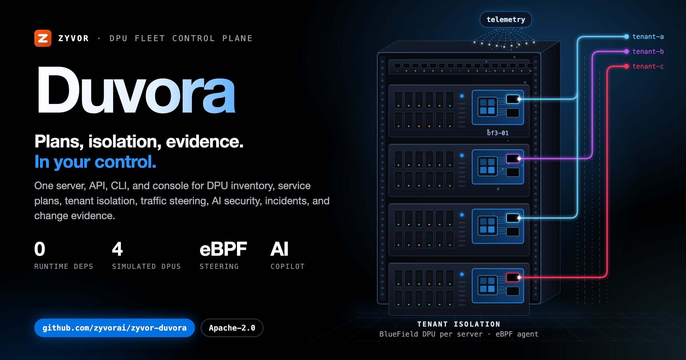
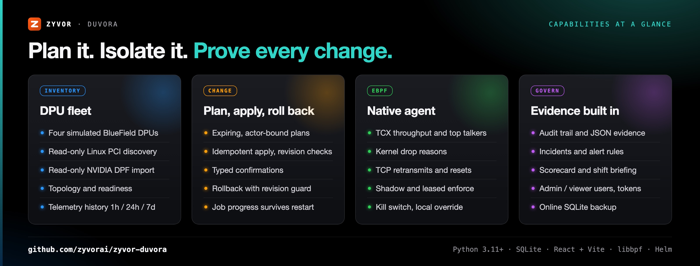
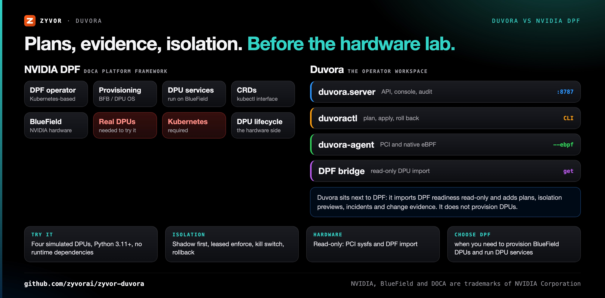
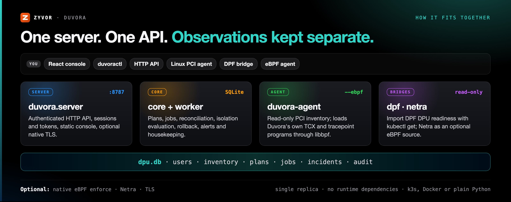
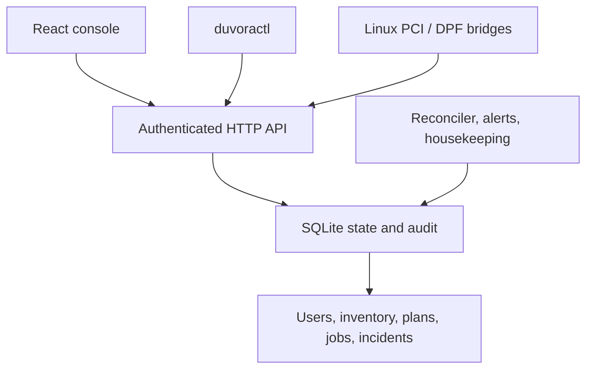

<div align="center">

# Duvora

[](LICENSE)
[](https://www.python.org/)
[](web/)
[](helm/duvora)
[](bpf)

[](https://zyvor.dev/schedule?utm_source=github&utm_medium=duvora&utm_campaign=readme_hero)
[](https://zyvor.dev/poc?utm_source=github&utm_medium=duvora&utm_campaign=readme_hero)
[](#quickstart)



### Plans, isolation, evidence. In your control.

**One server, one API, one CLI and one console for DPU inventory, service plans, tenant isolation models, operational telemetry, incidents and change evidence.** A native eBPF agent adds kernel telemetry and node isolation in shadow or leased enforce mode, and the whole workflow runs on four simulated BlueField devices before you touch hardware.

**Zero runtime dependencies** · **4 simulated BlueField DPUs** · **Native eBPF agent** · **Shadow before enforce** · **Audit trail for every change**

[**Quickstart**](#quickstart) · [**Deploy**](#deploy) · [**API**](docs/API.md) · [**Operations**](docs/OPERATIONS.md) · [**Status**](docs/STATUS.md) · [**License**](#license-and-support)

</div>

---

> **Status: 0.4.0 is a runnable evaluation release.** It implements a complete local simulation workflow, read-only hardware inventory bridges, and native eBPF: the host agent (`duvora-agent --ebpf`) loads Duvora's own programs for kernel telemetry and node isolation in shadow or leased enforce mode, with [Netra](https://github.com/zyvorai/zyvor-netra) as an optional alternative source ([docs/EBPF.md](docs/EBPF.md)). It does not flash firmware, provision physical DPUs, launch DPU containers, enforce DPU hardware policies, or accelerate storage. See the [capability matrix](docs/STATUS.md) before using it.

## What's new

| Release | What landed |
|---|---|
| **0.4.0** | Native eBPF, no sidecar: `duvora-agent --ebpf auto\|required` loads Duvora's own programs through the system libbpf (Python ctypes) |
| **0.4.0** | Four BPF programs: TCX counters and top talkers (`duvora_iface`), kernel drop reasons (`duvora_drops`), TCP retransmits and resets (`duvora_tcp`), allow-only egress node isolation (`duvora_nodeiso`) |
| **0.4.0** | Agent-side safety: enforce falls back to shadow when the lease lapses or the control plane is unreachable; `/run/duvora/isolation-off` turns isolation off locally |
| **0.4.0** | Helm `agent.*` DaemonSet (disabled by default), `Dockerfile.agent`, and Linux kernel tests (`make bpf-test`) in CI |
| **0.3.0** | Netra bridge for kernel-measured telemetry, shadow and leased enforce isolation, and a kill switch that demotes every enforced node to shadow |
| **0.2.0** | React console in the Netra design language, password sign-in, incidents, scorecard, topology, Helm/k3s deploy |

Full history: [CHANGELOG.md](CHANGELOG.md).

## Why Duvora

| When this happens… | Duvora gives you… |
|---|---|
| You want to design DPU service and isolation workflows before the BlueField lab is ready | Four simulated BlueField devices with persistent service, isolation, release, upgrade and rollback workflows, clearly labeled as simulated |
| A change goes out and nobody can say who approved what, against which device state | Plans bound to their creator that expire in five minutes and capture device revisions, idempotent apply, and an audit trail with JSON evidence export |
| A rollback would silently overwrite someone else's later change | Rollback restores a snapshot with a revision guard and refuses to overwrite later device changes |
| You need node isolation but cannot risk cutting off SSH or the controller | Shadow first, enforce only after a shadow run of the same allow-list, leased enforcement, a kill switch, an agent fail-safe and a local override file |
| Kernel telemetry means running another vendor's agent on every node | Duvora's own TCX and tracepoint programs, loaded by the agent through libbpf, with Netra as an optional alternative source |
| Hardware facts live in a dozen places | Read-only Linux PCI discovery and a read-only NVIDIA DPF import that can never overwrite simulator identities or grant enforcement |



---

## Duvora vs NVIDIA DPF



Duvora is not a DPF replacement: it reads DPF's DPU objects and adds the operator workflow around them.

| | **Duvora** | **NVIDIA DPF** (DOCA Platform Framework) |
|---|---|---|
| Role | Operator workspace: inventory, plans, isolation models, incidents, evidence | Provisioning and orchestration of BlueField DPUs and DPU services |
| Runs on | One Python 3.11+ server with SQLite; k3s, Docker or plain Python | Kubernetes, with NVIDIA's operators |
| Try it without hardware | Yes, four simulated BlueField devices | Needs BlueField DPUs |
| DPU provisioning and firmware | Not implemented | Yes |
| DPU services | Simulated lifecycle only, no containers launched | Deploys services onto DPUs |
| Change control | Expiring actor-bound plans, typed confirmations, revision-guarded rollback, audit trail | Kubernetes resources and their controllers |
| Relationship | Imports `dpus.provisioning.dpu.nvidia.com` read-only with `kubectl get` | Source of truth for DPU state |
| **Choose DPF when** | | You need to provision BlueField DPUs, manage their OS and firmware, and run DPU services in production |

---

## How it fits together





The control plane keeps observations separate from simulated desired state. Physical reports cannot overwrite simulator identities or grant enforcement capabilities. Plans bind to their creator, expire in five minutes, and capture device revisions. Apply is idempotent and refuses conflicting jobs. Job progress survives restart; rollback refuses to overwrite later device changes.

---

## Quickstart

The server needs Python 3.11+ and no runtime dependencies. The console is built once with Node 22+:

```bash
git clone https://github.com/zyvorai/zyvor-duvora.git && cd duvora
```

```bash
make web                              # npm ci + vite build into duvora/static
python3 -m duvora.server --demo
```

Open **http://127.0.0.1:8787** and sign in as **admin / Admin@321** (set `DUVORA_ADMIN_PASSWORD` to choose another initial password). Four simulated BlueField devices appear. The model persists in `dpu.db` across restarts. Without a built console the server still serves the API and a short page explaining how to build it.

For console development, run `make web-dev` (Vite on :5173, proxying `/api` to :8787).

## A console shaped around the operator

The console uses the Zyvor Netra design language — the same sign-in screen, mega-menu navigation, page heroes, light-first surfaces, and dark mode — built with React, Vite, and TypeScript.

| Group | Pages |
|---|---|
| Overview | Fleet pulse, readiness, sources, activity |
| Fleet | DPU fleet (search, filters, inspect), Topology, Telemetry history (1h/24h/7d) |
| Operate | Services, Isolation (plan, apply, evaluate), Operations (jobs, rollback) |
| Monitor | Incidents, Alert rules, Scorecard, Shift briefing (Markdown download) |
| Govern | Audit trail, Users (admin/viewer, passwords, tokens), Capabilities |

Select a device in **DPU fleet**, open **Isolation**, create a policy, preview it, and apply the simulation. Watch the job complete in **Operations**. Test an allowed and denied destination, then roll back the job. Viewers see everything with write controls disabled.

## CLI

```bash
python3 -m pip install .
duvoractl --url http://127.0.0.1:8787 login     # saves a personal token in ~/.duvora/env
duvoractl devices
duvoractl plan examples/isolate.json
duvoractl apply PLAN_ID --confirm 'APPLY SIMULATION'
duvoractl incidents && duvoractl scorecard && duvoractl report --markdown
duvoractl history bf3-01 --window 24h
duvoractl users add alice --role viewer
duvoractl backup duvora.db
```

Without installing, replace `duvoractl` with `python3 -m duvora.cli`. Secrets are never accepted as command-line flags. Remote URLs require HTTPS; `DUVORA_CA_FILE` trusts a self-signed deployment.

## Hardware inventory

Linux PCI discovery reads sysfs without modifying a device:

```bash
python3 -m duvora.agent --host gpu-01 --site pune
# Use a key whose principal is agent:gpu-01:
export DUVORA_TOKEN='your-host-bound-agent-key'
python3 -m duvora.agent --host gpu-01 --site pune --submit --interval 30
```

NVIDIA DPF bridge uses your existing kubectl context, with `get` access only:

```bash
python3 -m duvora.dpf --context LAB_CONTEXT --namespace dpf-operator-system \
  --host dpf-bridge --site pune --submit
```

Configure the corresponding `agent:dpf-bridge` key. DPF import uses `dpus.provisioning.dpu.nvidia.com` and reports readiness; it does not control DPF. [Hardware integration →](docs/HARDWARE.md)

## Deploy

Deployment follows Netra's model:

```bash
./scripts/deploy-remote.sh user@10.0.1.5            # k3s + Helm, https://<host>:30880
./scripts/deploy-remote.sh user@10.0.1.5 --docker   # podman/docker, no Kubernetes
./scripts/deploy-remote.sh user@10.0.1.5 --dry-run  # print what would run
```

Also available: `helm/duvora` chart, `docker compose up --build`, and plain manifests in `deploy/`. One replica with a persistent volume: SQLite is a single-control-plane backend. [Operations and deployment →](docs/OPERATIONS.md) · [API →](docs/API.md) · [Plan →](docs/PLAN.md) · [Validation →](docs/VALIDATION.md)

## Verify

```bash
make check                            # Python tests, web typecheck + Vitest, helm lint, script syntax
node tests/e2e.cjs                    # Playwright workflow against a running demo server
```

## Project layout

| Path | Responsibility |
|---|---|
| `duvora/core.py` | SQLite state, plans, reconciliation, isolation evaluation, rollback, housekeeping |
| `duvora/auth.py` | Users, password hashing, sessions, API tokens, sign-in rate limit |
| `duvora/history.py`, `alerts.py`, `reports.py` | Telemetry history, alert rules and incidents, scorecard/briefing/topology |
| `duvora/server.py` | HTTP routes, authentication, static console, TLS |
| `duvora/cli.py` | `duvoractl` |
| `duvora/agent.py`, `dpf.py` | Read-only Linux PCI and DPF inventory |
| `web/` | React + Vite + TypeScript console (builds into `duvora/static`) |
| `helm/duvora`, `scripts/deploy-*.sh` | Helm chart and remote deploy |
| `tests/` | Unit, HTTP integration, browser workflow suite |
| `deploy/` | Plain Kubernetes and DPF observer RBAC templates |
| `docs/` | Plan, limits, integration, API, operations, validation |

---

## Maturity

> **0.4.0 is a complete runnable evaluation repository, not a complete production DPU orchestration implementation.** Working and tested: the HTTP API and SQLite persistence, sign-in and users, the console, the CLI, telemetry history, alert rules and incidents, the simulation workflows, read-only PCI and DPF inventory, the native eBPF agent, and shadow and enforced node isolation (live tested on Linux 7.0 beside Cilium). **Not implemented:** hardware OS provisioning, DPU service execution, DPU hardware firewall or tenant isolation, firmware/BFB flashing, vendor hardware counter collectors, NVMe-oF/DOCA SNAP/RDMA offload, SSO/OIDC, tenant RBAC and HA. Node isolation is host-kernel enforcement on the node, not DPU offload. The full matrix: [docs/STATUS.md](docs/STATUS.md).

---

## Part of the Zyvor stack

| Product | Role next to Duvora |
|---|---|
| **Duvora** | DPU fleet control plane: inventory, plans, isolation, telemetry, incidents, evidence |
| **[Netra](https://github.com/zyvorai/zyvor-netra)** | eBPF network observability; an optional telemetry and node-isolation source for Duvora (`DUVORA_EBPF_SOURCE=netra`) |
| **[Gryvia](https://github.com/zyvorai/zyvor-gryvia)** | Kubernetes GPU platform; pairs with Duvora on accelerated clusters |
| **[Rivora](https://github.com/zyvorai/zyvor-rivora)** | eBPF L4 load balancer for the same bare-metal clusters |

→ [zyvor.dev](https://zyvor.dev)

---

## License and support

Duvora is **free and open source** under the [Apache License 2.0](LICENSE). That does not change. The console reuses the Zyvor Netra stylesheets and marks, which Zyvor AI Labs licenses here under Apache-2.0; see [NOTICE](NOTICE). The Zyvor name and marks remain trademarks. Vendor SDKs, images, and firmware are not bundled and retain their own terms.

**Zyvor Enterprise** adds what production teams ask for: supported releases, deployment and upgrade guidance, priority incident triage, a named technical contact and 24x7 critical intake. Plans and terms: [docs/SUBSCRIPTION-MODEL.md](docs/SUBSCRIPTION-MODEL.md) · [Pricing](https://zyvor.dev/pricing?utm_source=github&utm_medium=duvora&utm_campaign=readme_license) · [sales@zyvor.dev](mailto:sales@zyvor.dev).

[Security →](SECURITY.md) · [Contributing →](CONTRIBUTING.md)

---

<div align="center">

### Run your DPU fleet workflow before the hardware arrives

[](https://zyvor.dev/schedule?utm_source=github&utm_medium=duvora&utm_campaign=readme_footer)
[](https://zyvor.dev/poc?utm_source=github&utm_medium=duvora&utm_campaign=readme_footer)
[](https://zyvor.dev/pricing?utm_source=github&utm_medium=duvora&utm_campaign=readme_footer)
[](mailto:sales@zyvor.dev?subject=Duvora)
[](https://github.com/zyvorai/zyvor-duvora)

</div>
