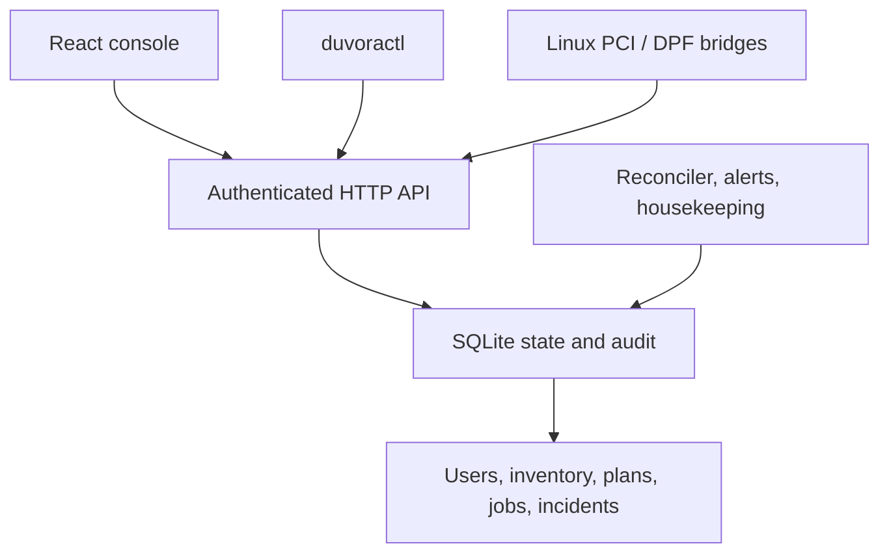

<div align="center">


# Duvora

**Infrastructure. In your control.**

[](LICENSE)
[](https://www.python.org/)
[](web/)
[](helm/duvora)

[**Quick Start**](#start-in-one-command) · [**Deploy**](#deploy) · [**API**](docs/API.md) · [**Operations**](docs/OPERATIONS.md) · [**Status**](docs/STATUS.md) · [**License**](#license)

</div>

> **Status: 0.4.0 is a runnable evaluation release.** It implements a complete local simulation workflow, read-only hardware inventory bridges, and native eBPF: the host agent (`duvora-agent --ebpf`) loads Duvora's own programs for kernel telemetry and node isolation in shadow or leased enforce mode, with [Netra](https://github.com/zyvorai/zyvor-netra) as an optional alternative source ([docs/EBPF.md](docs/EBPF.md)). It does not flash firmware, provision physical DPUs, launch DPU containers, enforce DPU hardware policies, or accelerate storage. See the [capability matrix](docs/STATUS.md) before using it.

One standalone workspace for DPU inventory, service plans, tenant isolation models, operational telemetry, incidents, and change evidence. One server, one API, one CLI, one console. CLI: `duvoractl`.

```bash
git clone https://github.com/zyvorai/zyvor-duvora.git && cd duvora
```

## Start in one command

The server needs Python 3.11+ and no runtime dependencies. The console is built once with Node 22+:

```bash
make web                              # npm ci + vite build into duvora/static
python3 -m duvora.server --demo
```

Open **http://127.0.0.1:8787** and sign in as **admin / Admin@321** (set `DUVORA_ADMIN_PASSWORD` to choose another initial password). Four simulated BlueField devices appear. The model persists in `dpu.db` across restarts. Without a built console the server still serves the API and a short page explaining how to build it.

For console development, run `make web-dev` (Vite on :5173, proxying `/api` to :8787).

## A console shaped around the operator

The console uses the Zyvor Netra design language — the same sign-in screen, mega-menu navigation, page heroes, light-first surfaces, and dark mode — built with React, Vite, and TypeScript.

| Group | Pages |
|---|---|
| Overview | Fleet pulse, readiness, sources, activity |
| Fleet | DPU fleet (search, filters, inspect), Topology, Telemetry history (1h/24h/7d) |
| Operate | Services, Isolation (plan, apply, evaluate), Operations (jobs, rollback) |
| Monitor | Incidents, Alert rules, Scorecard, Shift briefing (Markdown download) |
| Govern | Audit trail, Users (admin/viewer, passwords, tokens), Capabilities |

Select a device in **DPU fleet**, open **Isolation**, create a policy, preview it, and apply the simulation. Watch the job complete in **Operations**. Test an allowed and denied destination, then roll back the job. Viewers see everything with write controls disabled.

## CLI

```bash
python3 -m pip install .
duvoractl --url http://127.0.0.1:8787 login     # saves a personal token in ~/.duvora/env
duvoractl devices
duvoractl plan examples/isolate.json
duvoractl apply PLAN_ID --confirm 'APPLY SIMULATION'
duvoractl incidents && duvoractl scorecard && duvoractl report --markdown
duvoractl history bf3-01 --window 24h
duvoractl users add alice --role viewer
duvoractl backup duvora.db
```

Without installing, replace `duvoractl` with `python3 -m duvora.cli`. Secrets are never accepted as command-line flags. Remote URLs require HTTPS; `DUVORA_CA_FILE` trusts a self-signed deployment.

## Hardware inventory

Linux PCI discovery reads sysfs without modifying a device:

```bash
python3 -m duvora.agent --host gpu-01 --site pune
# Use a key whose principal is agent:gpu-01:
export DUVORA_TOKEN='your-host-bound-agent-key'
python3 -m duvora.agent --host gpu-01 --site pune --submit --interval 30
```

NVIDIA DPF bridge uses your existing kubectl context, with `get` access only:

```bash
python3 -m duvora.dpf --context LAB_CONTEXT --namespace dpf-operator-system \
  --host dpf-bridge --site pune --submit
```

Configure the corresponding `agent:dpf-bridge` key. DPF import uses `dpus.provisioning.dpu.nvidia.com` and reports readiness; it does not control DPF. [Hardware integration →](docs/HARDWARE.md)

## Architecture



The control plane keeps observations separate from simulated desired state. Physical reports cannot overwrite simulator identities or grant enforcement capabilities. Plans bind to their creator, expire in five minutes, and capture device revisions. Apply is idempotent and refuses conflicting jobs. Job progress survives restart; rollback refuses to overwrite later device changes.

## Deploy

Deployment follows Netra's model:

```bash
./scripts/deploy-remote.sh user@10.0.1.5            # k3s + Helm, https://<host>:30880
./scripts/deploy-remote.sh user@10.0.1.5 --docker   # podman/docker, no Kubernetes
./scripts/deploy-remote.sh user@10.0.1.5 --dry-run  # print what would run
```

Also available: `helm/duvora` chart, `docker compose up --build`, and plain manifests in `deploy/`. One replica with a persistent volume: SQLite is a single-control-plane backend. [Operations and deployment →](docs/OPERATIONS.md) · [API →](docs/API.md) · [Plan →](docs/PLAN.md) · [Validation →](docs/VALIDATION.md)

## Verify

```bash
make check                            # Python tests, web typecheck + Vitest, helm lint, script syntax
node tests/e2e.cjs                    # Playwright workflow against a running demo server
```

## Project layout

| Path | Responsibility |
|---|---|
| `duvora/core.py` | SQLite state, plans, reconciliation, isolation evaluation, rollback, housekeeping |
| `duvora/auth.py` | Users, password hashing, sessions, API tokens, sign-in rate limit |
| `duvora/history.py`, `alerts.py`, `reports.py` | Telemetry history, alert rules and incidents, scorecard/briefing/topology |
| `duvora/server.py` | HTTP routes, authentication, static console, TLS |
| `duvora/cli.py` | `duvoractl` |
| `duvora/agent.py`, `dpf.py` | Read-only Linux PCI and DPF inventory |
| `web/` | React + Vite + TypeScript console (builds into `duvora/static`) |
| `helm/duvora`, `scripts/deploy-*.sh` | Helm chart and remote deploy |
| `tests/` | Unit, HTTP integration, browser workflow suite |
| `deploy/` | Plain Kubernetes and DPF observer RBAC templates |
| `docs/` | Plan, limits, integration, API, operations, validation |

## License

Commercial subscriptions and support: see [docs/SUBSCRIPTION-MODEL.md](docs/SUBSCRIPTION-MODEL.md).

Apache-2.0. The console reuses the Zyvor Netra stylesheets and marks, which Zyvor AI Labs licenses here under Apache-2.0; see [NOTICE](NOTICE). The Zyvor name and marks remain trademarks. Vendor SDKs, images, and firmware are not bundled and retain their own terms. [Security →](SECURITY.md) · [Contributing →](CONTRIBUTING.md)
